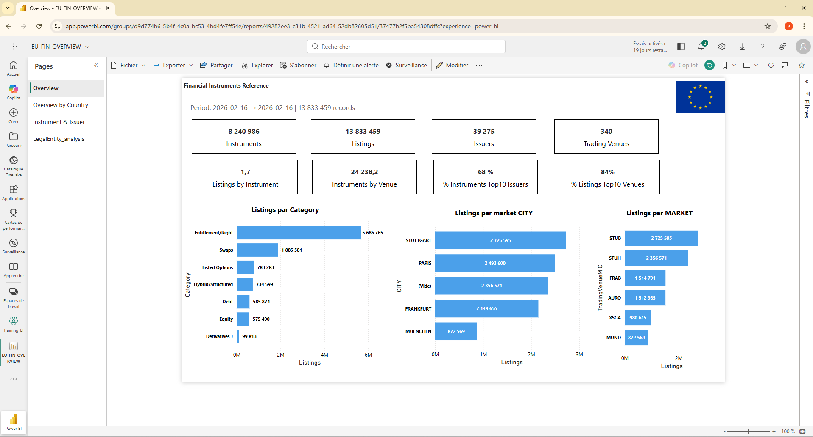
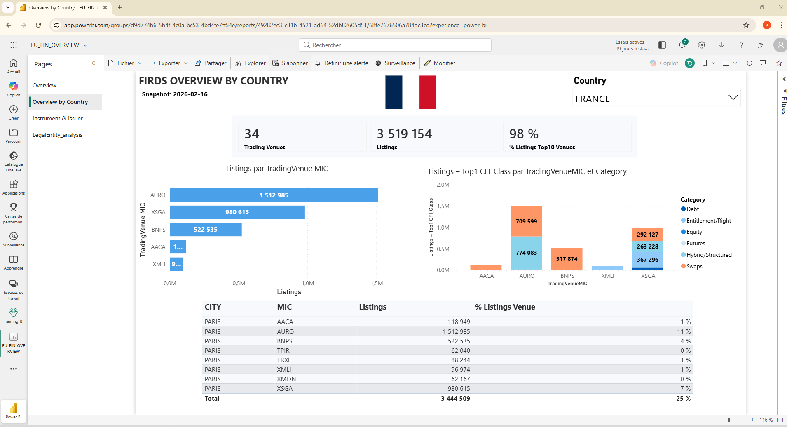
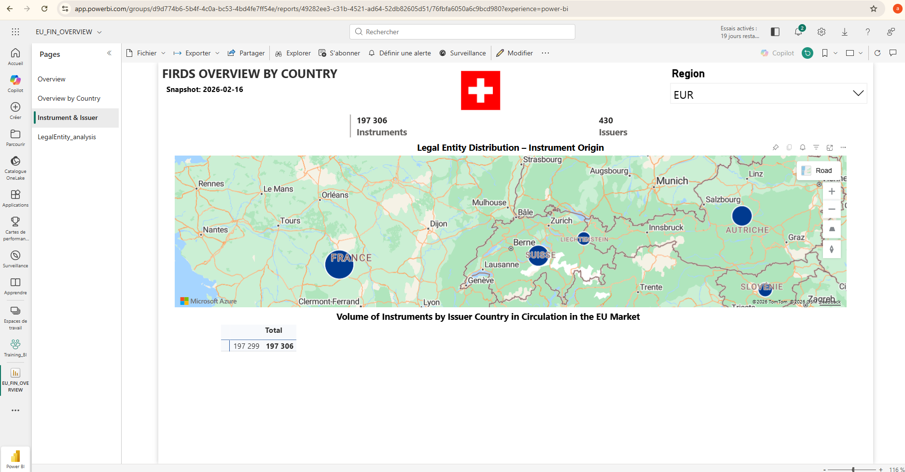
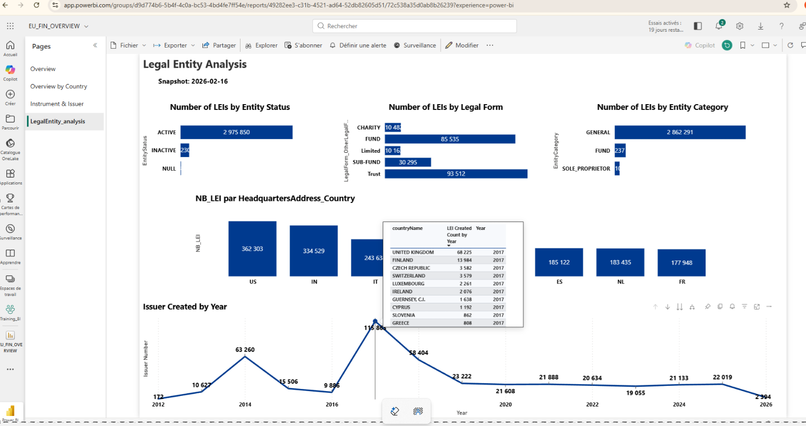

# ESMA - Plateforme de Reporting

## Vue fonctionnelle

Le projet alimente une chaine de reporting reglementaire et analytique autour des instruments financiers europeens.

### Finalites metier

- Consolider les donnees ESMA (FIRDS) pour les besoins reglementaires.
- Enrichir la vision emetteur via les donnees GLEIF (LEI).
- Completer avec les donnees de marche Boursorama pour l'analyse.
- Exposer des indicateurs et vues de pilotage dans Power BI.

### Parcours fonctionnel

1. Collecte des donnees sources (ESMA, GLEIF, Boursorama).
2. Normalisation et chargement en zone de staging.
3. Transformation vers modele DWH/MART.
4. Consommation dans les rapports de suivi et de reporting.

### Captures fonctionnelles (SFG Reporting)

#### Vue d'ensemble

#### Vue par pays

#### Vue instrument et emetteur

#### Vue legal entity

## Sommaire architecture technique (composants)

### Sources

- ESMA FIRDS (FULL/DELTA).
- GLEIF Golden Copy (LEI, relations, exceptions).
- Boursorama (produits de marche, cotations).

### Traitements ETL

- Orchestrateur Python `src/python/orchestrator_optimized.py`.
- Pipelines:
  - `ETL_FULIN_DTIN` (ingestion ESMA + executions procedures SQL).
  - `ETL_GLEIF_LEI` (download, filtrage, chargement SQL).
  - `ETL_BOURSORAMA` (scraping + loader staging).

### Stockage

- SQL Server `KHLWorldInvest` (staging + logs applicatifs).
- SQL Server `DWH_KHLWorldInvest` (dimensions/faits analytics).
- SQL Server `AUDIT_BI` (journalisation centralisee ETL).

### Restitution

- Rapport Power BI `powerbi_reporting/reports/EU_FIN_OVERVIEW.pbix`.

